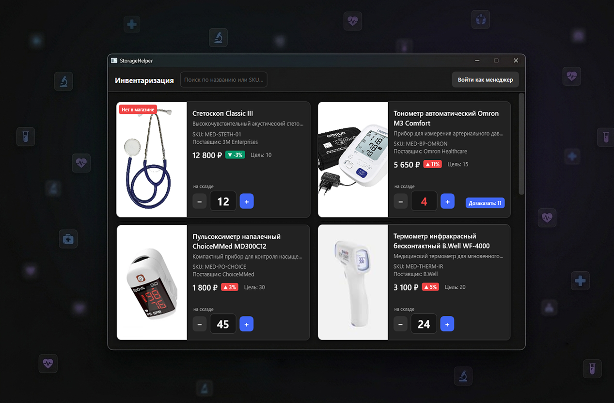
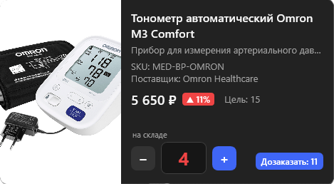
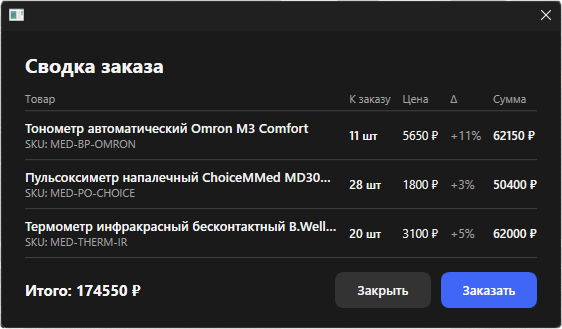
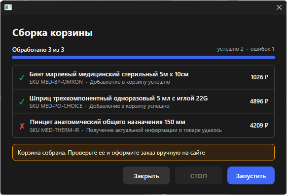

# StorageHelper

Настольное приложение для учёта склада и закупок небольшой медицинской клиники. Сотрудник пересчитывает остатки по карточкам товаров, программа сама считает, что и сколько нужно дозаказать, а менеджер просматривает итоговую корзину перед тем, как оформить заказ у поставщика. Отдельный модуль умеет полуавтоматически собирать эту корзину на сайте поставщика и останавливается ровно перед оплатой, чтобы человек всё проверил.

<p align="center">
  
</p>

> **Важно: это демонстрационный проект, а не готовый продукт.**
> StorageHelper сделан для портфолио. Идея взята из реального заказа на фрилансе (система для стоматологической клиники вместо ручного учёта в Excel) и адаптирована так, чтобы наглядно показать навыки, не превращаясь в полноценную коммерческую разработку. Поэтому здесь нет всего, что было бы в полной версии: нет полноценного управления пользователями, нет синхронизации между рабочими местами, автоматизация заточена под один сайт и сознательно ограничена. Что именно упрощено и почему, описано ниже.

## Зачем это и в чём идея

Типичная клиника ведёт учёт расходников в таблице: кто-то раз в неделю обходит шкафы, пересчитывает остатки, потом вручную прикидывает, чего не хватает, и оформляет заказ. Это медленно, легко ошибиться и невозможно отследить, как менялись цены.

StorageHelper закрывает этот сценарий целиком. Сотрудник проходит по списку карточек (картинка, название, целевой запас) и просто вбивает, сколько единиц товара сейчас на полке. Всё остальное программа берёт на себя: подсвечивает позиции, которых не хватает, считает количество к дозаказу, хранит историю цен и показывает менеджеру готовую сводку с итоговой суммой. А если нужно, помогает собрать корзину на сайте поставщика, но финальное решение и оплату всегда оставляет человеку.

Масштаб, на который рассчитана задача, небольшой: примерно от ста семидесяти до двухсот с небольшим товаров, одно-два рабочих места внутри клиники. Поэтому в основу заложена простота и надёжность, а не способность держать огромную нагрузку.

## Что умеет приложение

**Инвентаризация по карточкам.** Главный экран - это сетка карточек товаров. У каждой есть картинка, название, целевой запас и поле, куда вписывают текущее количество. Ввод устроен так, чтобы пересчитывать остатки было быстро даже с планшета: в числовые поля нельзя случайно вписать буквы, а изменения сохраняются автоматически, без отдельной кнопки. Карточки с нехваткой подсвечиваются, так что её видно сразу.

<p align="center">
  
</p>

**Управление товарами.** Менеджер может добавлять, редактировать и убирать товары сам, без программиста. Для этого есть отдельный диалог со всеми полями: SKU (главный идентификатор), название, описание, заметки, поставщик, ссылка на картинку, целевой запас, галочки "Активен" и "В наличии". Есть поиск по списку и переключатель, показывать ли неактивные позиции. SKU уникален - две карточки с одним и тем же артикулом завести нельзя.

**Цены и расчёт дозаказа.** История цен хранится отдельными записями, а не парой колонок текущая и прошлая. Из этой истории программа на лету вычисляет текущую цену, предыдущую и исторический минимум, а заодно показывает, насколько цена выросла по сравнению с прошлым разом. Количество к дозаказу считается просто и предсказуемо: разница между целевым запасом и тем, что есть на полке (если запас уже достаточный, к заказу выходит ноль).

**Сводка для менеджера.** Перед заказом менеджер открывает экран сводки. Туда попадают только активные товары, которые помечены как заказываемые и которых реально не хватает. По каждому видно количество, цену, индикатор изменения цены и сумму по строке, а внизу общий итог по всему заказу.

<p align="center">
  
</p>

**Полуавтоматическая сборка корзины.** Это ядро демонстрации. По списку из сводки программа сама заходит на сайт поставщика, находит каждый товар по SKU, проверяет его, снимает актуальную цену и название, добавляет в корзину и выставляет нужное количество. Каждый шаг пишется в лог прямо в окне, успехи и ошибки видно по ходу дела. Принципиальный момент: сборка останавливается перед оформлением. Программа доводит корзину до готовности и отдаёт управление человеку, проверить и оплатить заказ нужно вручную.

<p align="center">
  
</p>

## Технологии

Приложение написано на C# и .NET 8, интерфейс на WPF. Архитектура построена по образцу MVVM с помощью библиотеки CommunityToolkit.Mvvm, так что логика отделена от разметки. Данные лежат в локальной базе SQLite, доступ к ней идёт через EF Core 9 с миграциями. Зависимости собираются через встроенный контейнер из Microsoft.Extensions.DependencyInjection. За логирование отвечает Serilog: записи пишутся в файлы в папке `logs` с разбивкой по дням. Браузерная автоматизация сделана на Playwright для .NET.

## Как устроен код

Проект разбит на привычные для подобных приложений слои.

Модели данных лежат в папке `Models`. Главная сущность это `Item` товар со всеми полями и навигацией на историю цен, записи цен хранятся в `PriceRecord`, а настройки приложения в `AppSettings`.

Сервисы собраны в `Services`. Работа с базой спрятана за интерфейсом `IDataBaseService`, конфигурацией занимается `ConfigService`, входом менеджера `AuthService`, расчётами цен и сводки `PricingService`, показом модальных окон  `DialogService`. Доступ к базе организован через IDbContextFactory<StorageContext> для безопасной работы в многопоточной среде, а уникальный индекс на SKU задаётся в `StorageContext`. 

Вьюмодели в папке `ViewModels` связывают данные с экранами: список карточек и поиск, отдельная карточка с автосохранением, форма добавления и редактирования, вход менеджера, экран сводки и окно автоматизации. Сами экраны (XAML) лежат в `Views`, а вся палитра и стили собраны в одном файле `Styles/Theme.xaml`.

Модуль автоматизации вынесен в `Services/Automation` описания будет ниже.

## Запуск

Нужен установленный .NET 8 SDK и Windows. Из корня репозитория:

```
dotnet build
dotnet run --project StorageHelper
```

При первом запуске программа сама создаёт базу данных, применяет миграции и наполняет её несколькими демонстрационными товарами, чтобы экран не был пустым. База лежит в файле `Storage.db` рядом с приложением.

> Заметка: первоначальное наполнение демо-данными зашито прямо в код запуска и помечено как временное. В финальной версии этого блока быть не должно, товары добавляет менеджер через интерфейс.

Тесты запускаются обычным образом:

```
dotnet test
```

Тестами покрыта расчётная логика, самая ответственная и при этом легко проверяемая часть: вычисление статистики по ценам, количества к дозаказу и сборка строк сводки. Интерфейс и браузерная автоматизация тестами не покрыты сознательно: для демо-проекта это был бы непропорциональный объём работы.

## Режим менеджера и сброс пароля

Часть действий (добавление, редактирование и удаление товаров) доступна только в режиме менеджера. Вход защищён паролем.

Пароль не хранится в открытом виде. Используется PBKDF2 на основе SHA-256 со ста тысячами итераций и случайной солью, в файл настроек попадают только соль и хеш. Сравнение при входе сделано устойчивым ко времени, чтобы по скорости ответа нельзя было подбирать пароль.

Пароль задаётся при первом входе: если в настройках его ещё нет, то первый же введённый пароль становится рабочим. Отсюда вытекает простой способ сброса, который заодно объясняет, почему отдельной кнопки "Забыли пароль" здесь нет. Чтобы сбросить пароль, нужно удалить или открыть файл настроек и вручную стереть сохранённые соль и хеш. После этого следующий вход задаст новый пароль. Это сознательное упрощение для демо. В реальной системе, рассчитанной на внешний доступ, так делать было бы нельзя.

Настройки лежат в JSON-файле `Config/Config.json` рядом с приложением. Кроме пароля там хранится строка подключения к базе и переключатель режима автоматизации (о нём ниже). Если файла нет или он повреждён, приложение пересоздаёт его со значениями по умолчанию.

## Автоматизация подробно

Это самая интересная с инженерной точки зрения часть, и здесь же больше всего сознательных компромиссов.

**Подмена реализации одной настройкой.** Вся автоматизация спрятана за интерфейсом `IVendorAutomation`. Есть две реализации. Первая, `FakeVendorAutomation`, ничего не открывает в браузере, а просто имитирует работу: ждёт случайное время, иногда спотыкается на ошибке и возвращает правдоподобные данные. Она нужна для надёжной демонстрации, показать поведение приложения можно где угодно, не завися от живого сайта, авторизации и капчи. Вторая, `OzonAutomation`, работает с настоящим сайтом. Какая из них используется, решает один флаг в файле настроек: при старте программа смотрит на него и регистрирует нужную реализацию в контейнере зависимостей. Весь остальной код об этом выборе ничего не знает.

**Почему Ozon, а не реальный медицинский поставщик.** В исходной задаче поставщиком был профильный магазин медтоваров. Для портфолио он неудобен: закрытый, требует регистрации юрлица, его не покажешь. Поэтому в роли поставщика выступает Ozon, он публичный, наглядный и достаточно сложный технически, чтобы автоматизация выглядела убедительно. Принято допущение: SKU товара в базе считается артикулом товара на Ozon.

**Почему не обычный Playwright и без стелс-плагинов.** Ozon хорошо распознаёт автоматизированные браузеры, которые Playwright запускает сам. Бороться с этим стелс-плагинами, это гонка, которая в учебном проекте не имеет смысла и к тому же балансирует на грани правил сайта. Поэтому выбран честный и более устойчивый путь: приложение не поднимает свой браузер, а подключается по протоколу отладки (CDP) к настоящему Chrome или Edge, уже установленному в системе. Программа находит браузер в реестре или по стандартным путям, запускает его с открытым портом отладки и отдельным профилем, дожидается, пока порт станет доступен, и подключается к нему. Дальше она работает с обычными вкладками реального браузера.

**Авторизация и сессия.** Вход на сайт пользователь делает сам, руками, в видимом окне браузера. Программа лишь открывает страницу входа и ждёт, пока человек авторизуется (с разумным тайм-аутом). Сессия живёт в отдельном профиле браузера, поэтому при следующих запусках заходить заново не нужно. Браузер после сборки корзины не закрывается, т.к именно в нём пользователь и оформит заказ.

**Как снимаются данные о товаре.** Цена, название и описание берутся не из вёрстки страницы, а из встроенного на страницу блока структурированных данных в формате JSON-LD. Это заметно надёжнее. Для остальных действий программа цепляется за устойчивые опорные атрибуты разметки, а не за сгенерированные имена классов. Количество товара выставляется на странице корзины, а не на карточке товара, у карточек сложная вёрстка, а корзина единообразна.

**Остановка перед оплатой.** Это не техническое ограничение, а осознанное правило. Автоматизация доводит дело до собранной корзины и останавливается. Оформление и оплата всегда за человеком. Так и было в исходной задаче, и так правильнее: машина берёт на себя рутину, но решение о тратах остаётся за людьми.

**Ограничения, о которых честно стоит сказать.** Реальная автоматизация хрупка по своей природе: сайт может в любой момент поменять вёрстку, показать капчу или повести себя иначе в зависимости от региона (а от региона зависит и цена). Поэтому для надёжного показа и существует Fake-режим. Ошибки автоматизации пишутся в лог, так что при сбое видно, на чём именно всё остановилось.

**Дисклеймер.** Браузерная автоматизация Ozon сделана в учебных целях, чтобы продемонстрировать инженерные навыки. Автоматизированный доступ к сайту может противоречить пользовательскому соглашению и правилам площадки. Используйте на свой риск и перед любым реальным применением проверьте актуальные условия сервиса; автор не несёт ответственности за последствия использования. 

## Что сделано бы иначе в полной версии

Чтобы не создавать ложного впечатления, стоит проговорить, чего здесь намеренно нет. Это однопользовательское настольное приложение с локальной базой, без сервера и без синхронизации между рабочими местами. Режим менеджера, это один общий пароль, а не полноценные учётные записи с ролями. Автоматизация умеет работать с одним конкретным сайтом и опирается на допущения, которые в реальности пришлось бы согласовывать с поставщиком. Сброс пароля делается правкой файла настроек. Всё это нормально для внутреннего демонстрационного инструмента и было бы переделано, будь это реальный коммерческий продукт
